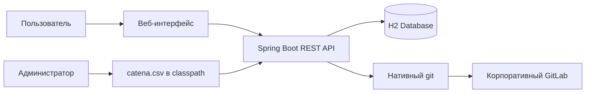
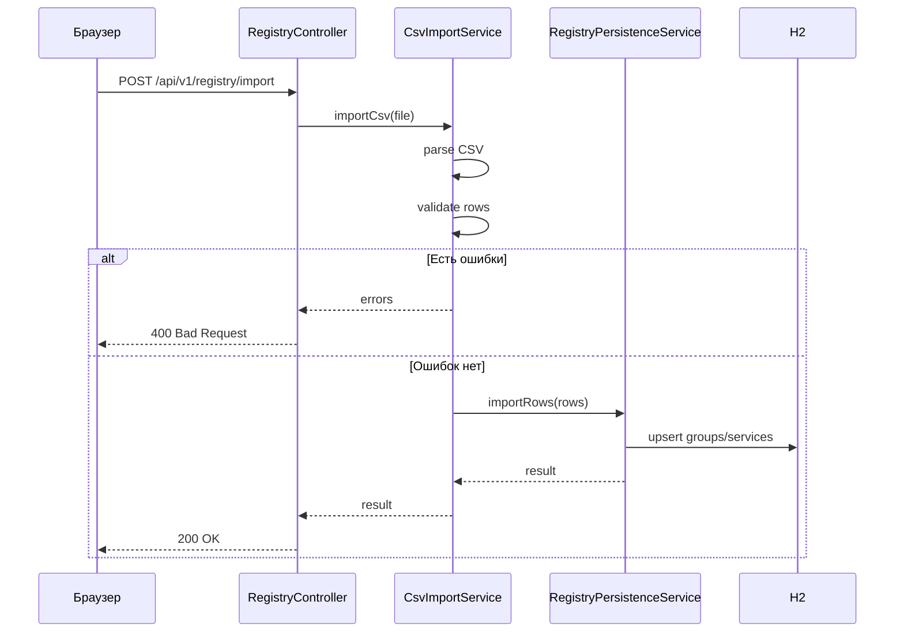
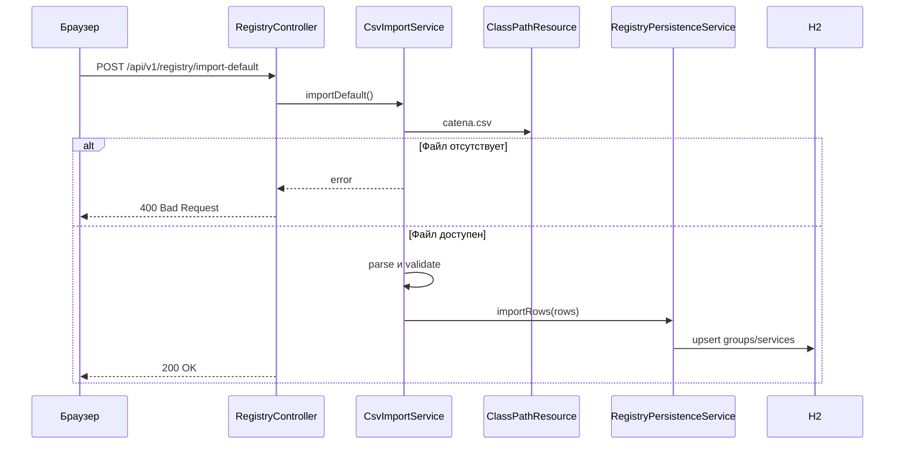
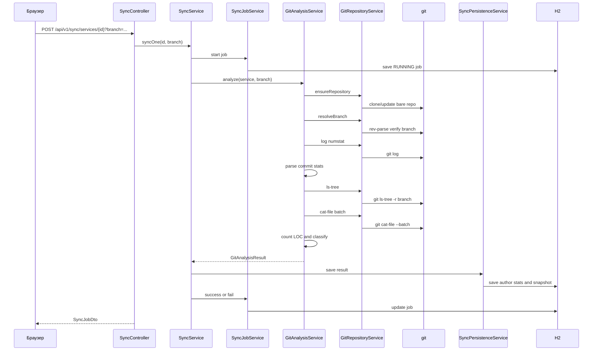
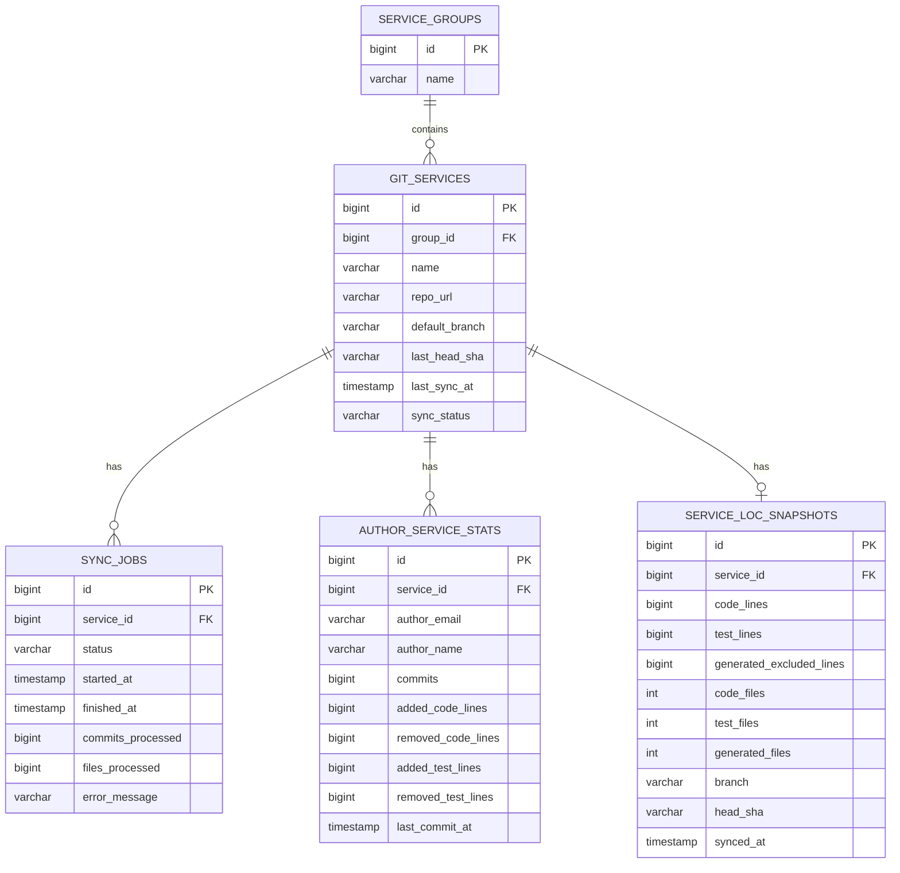

# Архитектура Git stat

## 1. Обзор архитектуры

Git stat — монолитное Spring Boot приложение, которое:

- принимает CSV-реестр сервисов;
- хранит реестр и статистику в H2;
- вызывает нативный `git` для клонирования, обновления и чтения репозиториев;
- парсит Git-вывод на стороне Java;
- сохраняет агрегированную статистику;
- предоставляет REST API и статический веб-интерфейс.

Архитектура выбрана максимально простой:

- одна БД;
- один процесс;
- без очередей;
- без воркеров;
- без внешнего кэша;
- без микросервисов.

---

## 2. Контекстная диаграмма



---

## 3. Компоненты приложения

### 3.1. Controller layer

Пакет:

```text
com.anri.gitloc.controller
```

Назначение:

- HTTP endpoints;
- валидация входных параметров на уровне API;
- маппинг ошибок.

Основные контроллеры:

| Класс | Назначение |
|---|---|
| `RegistryController` | Импорт CSV и `catena.csv` |
| `SyncController` | Запуск синхронизации и просмотр задач |
| `StatsController` | Получение статистики |
| `GlobalExceptionHandler` | Обработка ошибок REST API |

---

### 3.2. Service layer

Пакет:

```text
com.anri.gitloc.service
```

Назначение:

- бизнес-логика;
- импорт реестра;
- оркестрация синхронизации;
- Git-анализ;
- классификация файлов;
- сохранение результатов.

Основные сервисы:

| Класс | Назначение |
|---|---|
| `CsvImportService` | Парсинг и валидация CSV, импорт `catena.csv` |
| `RegistryPersistenceService` | Транзакционное сохранение групп и сервисов |
| `SyncService` | Оркестрация синхронизации одного или всех сервисов |
| `SyncJobService` | Управление статусами задач синхронизации |
| `GitAnalysisService` | Анализ истории коммитов и snapshot LOC |
| `GitRepositoryService` | Низкоуровневые Git-операции |
| `GitCommandService` | Запуск нативных Git-команд |
| `GitStorageService` | Управление локальными bare-репозиториями |
| `JavaFileClassifier` | Классификация `.java`-файлов |
| `SyncPersistenceService` | Сохранение результатов анализа в H2 |

---

### 3.3. Domain layer

Пакет:

```text
com.anri.gitloc.domain
```

Сущности JPA:

| Класс | Назначение |
|---|---|
| `ServiceGroup` | Группа сервисов |
| `GitService` | Сервис и URL репозитория |
| `SyncJob` | Задача синхронизации |
| `AuthorServiceStat` | Статистика автора по сервису |
| `ServiceLocSnapshot` | Текущий снимок LOC сервиса |
| `JavaCategory` | CODE, TEST, EXCLUDED |
| `JobStatus` | Статус задачи |
| `SyncStatus` | Статус сервиса |

---

### 3.4. Repository layer

Пакет:

```text
com.anri.gitloc.repository
```

Назначение:

- доступ к H2 через Spring Data JPA;
- JPQL-запросы для агрегаций;
- явные запросы там, где derived query name нестабилен.

Основные репозитории:

| Класс | Назначение |
|---|---|
| `ServiceGroupRepository` | Группы |
| `GitServiceRepository` | Сервисы |
| `SyncJobRepository` | Задачи синхронизации |
| `AuthorServiceStatRepository` | Статистика авторов |
| `ServiceLocSnapshotRepository` | Снимки LOC и агрегаты |

---

### 3.5. DTO layer

Пакет:

```text
com.anri.gitloc.dto
```

Назначение:

- транспортные объекты для API;
- проекции для статистики;
- разделение доменной модели и внешнего контракта.

---

### 3.6. Web layer

Каталог:

```text
src/main/resources/static
```

Содержит:

- `index.html`;
- `styles.css`;
- `app.js`.

Frontend реализован как простой статический интерфейс без SPA-фреймворка.

---

## 4. Поток данных

### 4.1. Импорт CSV



---

### 4.2. Импорт catena.csv



---

### 4.3. Синхронизация сервиса



---

## 5. Git-подсистема

### 5.1. Почему нативный git

Использован нативный `git`, а не JGit, потому что:

- формат `--numstat` хорошо соответствует задаче;
- поведение ближе к классическому Git;
- проще получать `ls-tree` и `cat-file --batch`;
- для сервиса не требуется встроенный Git-движок.

Недостаток:

- в среде выполнения должен быть установлен `git`.

---

### 5.2. Хранение репозиториев

Локальные репозитории хранятся как bare:

```text
{app.git.storage-path}/service-{id}/repo.git
```

Пример:

```text
./git-repos/service-1/repo.git
```

Bare-репозиторий выбран потому, что:

- не нужна рабочая директория;
- меньше риск случайного изменения файлов;
- достаточно для чтения истории и деревьев.

---

### 5.3. Определение ветки

Если ветка не задана:

```bash
git symbolic-ref --short HEAD
```

fallback:

```bash
git rev-parse --abbrev-ref HEAD
```

Если ветка задана:

```bash
git rev-parse --verify --quiet <branch>^{commit}
```

Если ветка не найдена, выбрасывается `GitException`.

---

### 5.4. История коммитов

Команда:

```bash
git -c core.quotePath=false log \
  --no-merges \
  --no-renames \
  --reverse \
  --date=iso-strict \
  --pretty=format:"%H%x09%ad%x09%ae%x09%an%x09%s" \
  --numstat \
  <branch>
```

Пояснения:

- `--no-merges` исключает merge-коммиты;
- `--no-renames` упрощает парсинг путей;
- `--reverse` идёт от старых коммитов к новым;
- `core.quotePath=false` предотвращает экранирование не-ASCII путей;
- pathspec не используется, фильтрация `.java` выполняется в Java.

---

### 5.5. Snapshot файлов

Команда:

```bash
git -c core.quotePath=false ls-tree -r <branch>
```

Формат:

```text
<mode> <type> <oid> TAB <path>
```

Фильтрация:

- только `type == blob`;
- только путь заканчивается на `.java`.

---

### 5.6. Подсчёт строк

Команда:

```bash
git cat-file --batch
```

В stdin подаются oid объектов.

Для каждого объекта:

- читается header: `<oid> <type> <size>`;
- если тип `blob`, читается `size` байт;
- считается количество `\n`;
- если файл непустой и не заканчивается на `\n`, добавляется одна строка.

Такой подход выбран потому, что запросы вида:

```text
<branch>:<path>
```

могли молча возвращать `missing` и давать нули.

---

## 6. Классификация файлов

Компонент:

```text
JavaFileClassifier
```

Логика:

1. Если путь не заканчивается на `.java`, файл исключается.
2. Если путь содержит маркеры generated/migration, категория `EXCLUDED`.
3. Если путь содержит тестовые маркеры или имя имеет тестовый суффикс, категория `TEST`.
4. Иначе `CODE`.

Порядок важен: сначала исключения, затем тесты, затем код.

---

## 7. Модель данных

### 7.1. ER-диаграмма



---

### 7.2. Почему у ServiceLocSnapshot суррогатный ключ

Изначально рассматривались варианты:

1. `@Id` на колонке `service_id` плюс `@OneToOne` на той же колонке.
2. `@MapsId` на ассоциации с `GitService`.

Оба варианта вызывали проблемы в стеке Spring Boot 4 / Spring Data JPA 4 / Hibernate 7:

- `null identifier`;
- `does not define an IdClass`.

Итоговое решение:

```java
@Id
@GeneratedValue(strategy = GenerationType.IDENTITY)
private Long id;

@OneToOne
@JoinColumn(name = "service_id", nullable = false, unique = true)
private GitService service;
```

Это самый надёжный вариант для Spring Data JPA.

---

### 7.3. Почему поле группы называется serviceGroup

В JPQL слово `group` является зарезервированным.

Поэтому Java-атрибут назван:

```java
private ServiceGroup serviceGroup;
```

а колонка в БД осталась:

```java
@JoinColumn(name = "group_id")
```

В JPQL используется:

```java
join s.serviceGroup g
```

и:

```java
s.serviceGroup.id
```

---

## 8. REST API архитектура

### 8.1. Registry API

```text
POST /api/v1/registry/import
POST /api/v1/registry/import-default
GET  /api/v1/registry/default-status
```

Назначение:

- загрузка пользовательского CSV;
- загрузка `catena.csv` из classpath;
- проверка доступности `catena.csv`.

---

### 8.2. Sync API

```text
POST /api/v1/sync/services/{serviceId}
POST /api/v1/sync/all
GET  /api/v1/sync/jobs
```

Параметр:

```text
branch
```

Назначение:

- запуск синхронизации;
- просмотр статуса задач.

---

### 8.3. Stats API

```text
GET /api/v1/stats/summary
GET /api/v1/stats/groups
GET /api/v1/stats/services
GET /api/v1/stats/services/{serviceId}
GET /api/v1/stats/authors
```

Назначение:

- агрегированная статистика для UI и внешних интеграций.

---

## 9. Frontend архитектура

Frontend — статический:

```text
src/main/resources/static/index.html
src/main/resources/static/styles.css
src/main/resources/static/app.js
```

Логика:

- при загрузке страницы вызывается `/api/v1/registry/default-status`;
- затем загружаются статистика и задачи синхронизации;
- действия пользователя вызывают REST API через `fetch`;
- после импорта или синхронизации данные перезагружаются.

Двухколоночная раскладка реализована CSS Grid:

```css
.controls-grid {
    display: grid;
    grid-template-columns: repeat(2, minmax(0, 1fr));
    gap: 20px;
}
```

На узких экранах колонки складываются в одну.

---

## 10. Безопасность

### 10.1. Доступ к GitLab

Разрешено:

- HTTPS;
- один allowlist хост;
- токен из ENV;
- право `read_repository`.

Запрещено:

- HTTP;
- SSH;
- git protocol;
- URL с `user:password`;
- URL с токеном;
- произвольные хосты.

---

### 10.2. Защита токена

Токен:

- не хранится в БД;
- не возвращается в API;
- подставляется в URL только для Git-операций;
- маскируется в сообщениях об ошибках.

---

### 10.3. Защита от опасных имён веток

Вручную введённая ветка валидируется регулярным выражением и дополнительными правилами:

- допустимы латинские буквы, цифры, `.`, `_`, `/`, `-`;
- запрещены пробелы и спецсимволы;
- запрещены имена, начинающиеся с `-`;
- запрещены `..`, `//`, окончание `.lock`.

---

### 10.4. Отсутствие пользовательской авторизации

В сервисе нет Spring Security, OIDC, SSO или ролей.

Это осознанное ограничение сервиса.

Рекомендация для эксплуатации:

- доступ только из внутренней сети;
- reverse proxy с аутентификацией;
- firewall;
- отключение H2 console в публичном окружении.

---

## 11. Наблюдаемость

В сервисе реализовано:

- логирование через SLF4J;
- DEBUG-логи snapshot;
- таблица `sync_jobs` с ошибками;
- H2 console.

Не реализовано:

- Micrometer metrics;
- distributed tracing;
- alerting;
- audit log.

---

## 12. Развёртывание

### 12.1. Локально

```bash
mvn clean package
java -jar target/git-stat-0.0.1-SNAPSHOT.jar
```

### 12.2. Каталоги

Приложение создаёт:

```text
./data
./git-repos
```

`./data` — H2.

`./git-repos` — bare-репозитории.

Эти каталоги не нужно коммитить.

---

## 13. Технические решения и обоснования

| Решение | Обоснование |
|---|---|
| H2 | Минимальная инфраструктура для сервиса |
| Нативный git | Надёжный парсинг `numstat`, `ls-tree`, `cat-file` |
| Bare repositories | Безопаснее и проще для чтения |
| Sequential sync | Проще контролировать нагрузку и ошибки |
| Surrogate key для snapshot | Совместимость со Spring Data JPA 4 |
| `serviceGroup` вместо `group` | Избежание конфликта с JPQL |
| Фильтрация `.java` в Java | Стабильнее, чем pathspec в разных Git-командах |
| `cat-file` по oid | Устраняет молчаливые нули в snapshot |
| Strict CSV import | Проще отладка реестра |
| Статический UI | Быстро и достаточно для сервиса |

---

## 14. Известные архитектурные ограничения

- Нет горизонтального масштабирования.
- Нет очереди задач.
- Нет distributed lock.
- Нет идемпотентного retry на уровне Git-операций.
- Нет хранения истории snapshot.
- Нет авторизации пользователей.
- Нет плагинов и расширяемой классификации через UI.
- Нет поддержки нескольких GitLab инстансов.